<h1 align="center">NBA Injury Action Retrieval</h1>

<p align="center">
  <strong>Given one risky/injury-prone movement, find its closest historical matches across a database of tracked NBA plays.</strong>
</p>

<p align="center">
   RNN autoencoder -> motion embedding -> PCA -> similarity metrics -> actions ranked by closeness" width="850"/>
</p>

---

## Overview

This is stage 3 — the analytical core — of a 3-part master's thesis pipeline:

1. [MixSortTracking_Dataset](../MixSortTracking_Dataset) tracks players in raw NBA broadcast clips.
2. [NBA-Players-Reconstruction](../NBA-Players-Reconstruction) turns each tracked player into a Kalman-smoothed 3D pose, exported as `players_data.json` (joint angles, angular/linear velocity & acceleration, normalized 2D/3D joints, per frame, per player).
3. **This repository** turns those pose sequences into a compact motion representation and uses it to **retrieve the plays that most resemble a given reference movement** — in practice, known non-contact injury clips (e.g. Markelle Fultz, Dario Šarić) and other biomechanically risky actions (e.g. a hard stepback), searched against clips from full games (`CHI_NYK`, `PAC_ATL`, …).

The motivating question: *if a player's mechanics on this play look like the mechanics right before a known injury, is that something worth flagging?*

---

## From time series to a fixed-size window

`players_data.json` is a long, irregular time series per player. It's cut into fixed windows before anything else — a sliding window over each player's frames, configurable in length, overlap and stride:

<p align="center">
  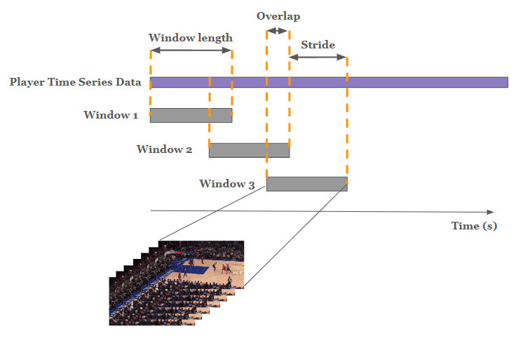
</p>

`AutoEncoder/dataloader_hybrid.py` implements this for 2-second windows at 60 fps (120 frames), requiring at least `num_frames - max_missing` valid frames per player, and builds each window's feature block from:

- **2D & 3D joint angles** — ankle / knee / hip, both legs
- **2D & 3D angular velocity** — same joints
- **3D linear velocity & acceleration** (norm) — knee & ankle, both legs
- **Raw 3D human joint coordinates** (`j3d_human`)

Because the same movement performed facing left vs. facing right shouldn't be treated as different actions, player skeletons are re-oriented to a canonical facing direction before feature extraction:

<p align="center">
  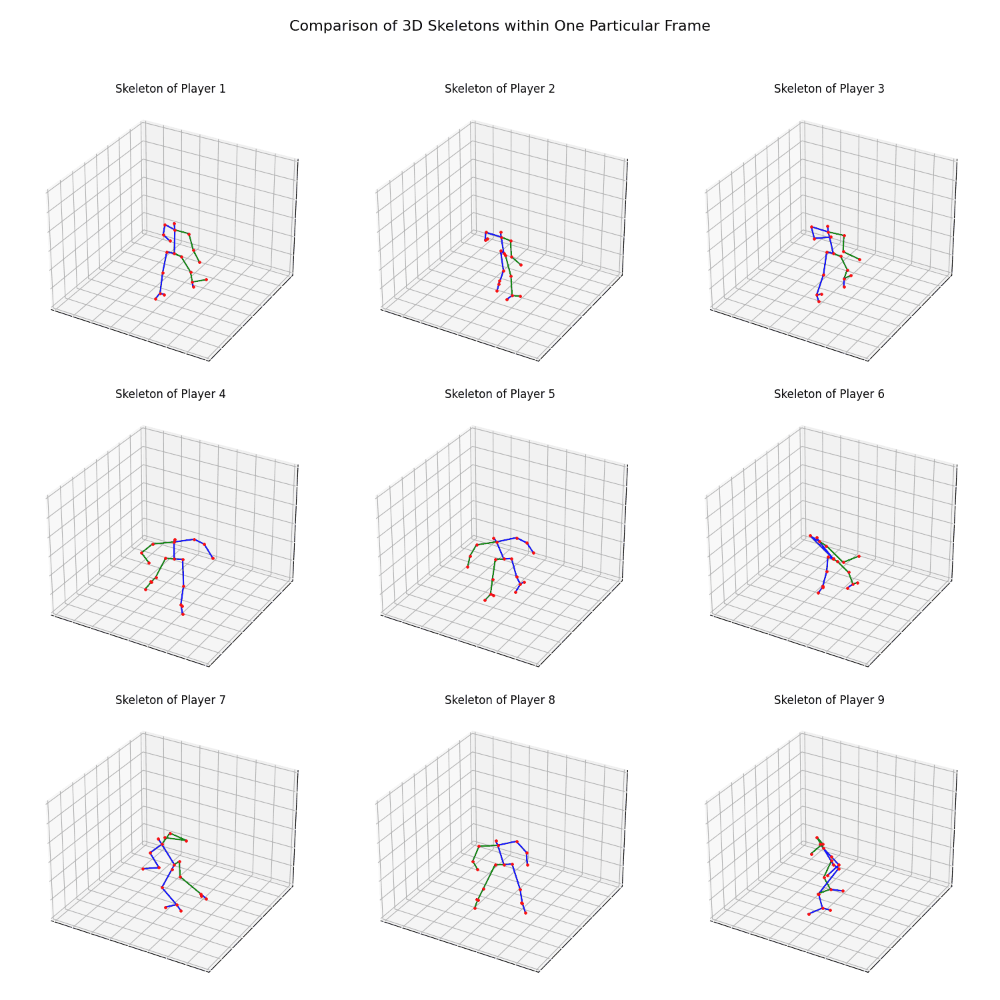
  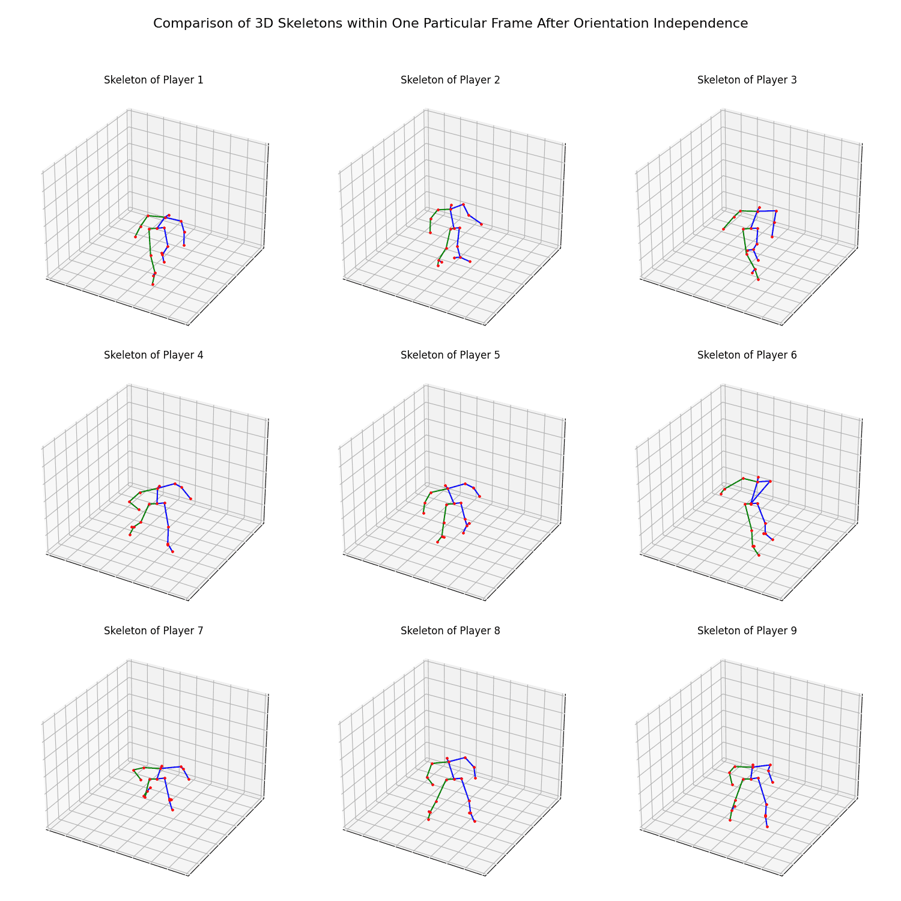
</p>

---

## Two retrieval approaches

**Naive** — PCA directly on the raw per-window feature vector, then similarity metrics straight on the reduced components:

<p align="center">
  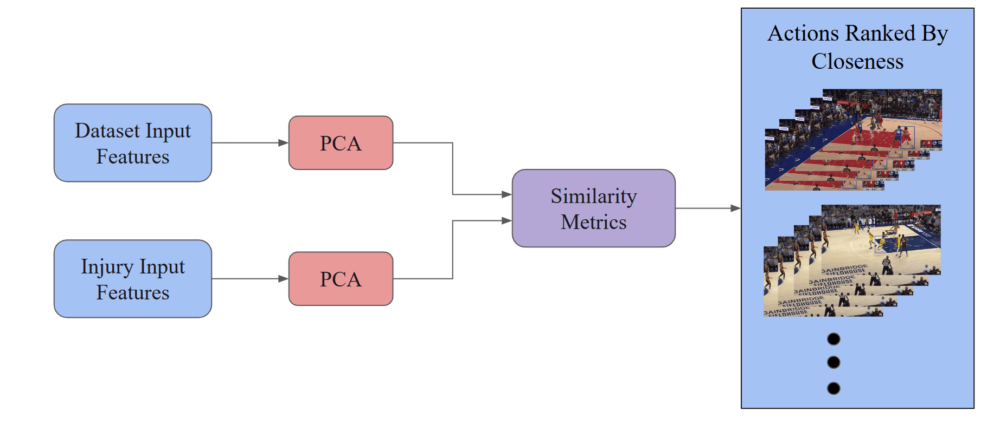 PCA -> similarity metrics -> actions ranked by closeness"/>
</p>

**Hybrid (autoencoder-based)** — an RNN autoencoder first learns a compact **motion embedding** from the windowed features, and similarity is computed in that learned latent space instead of raw feature space:

<p align="center">
  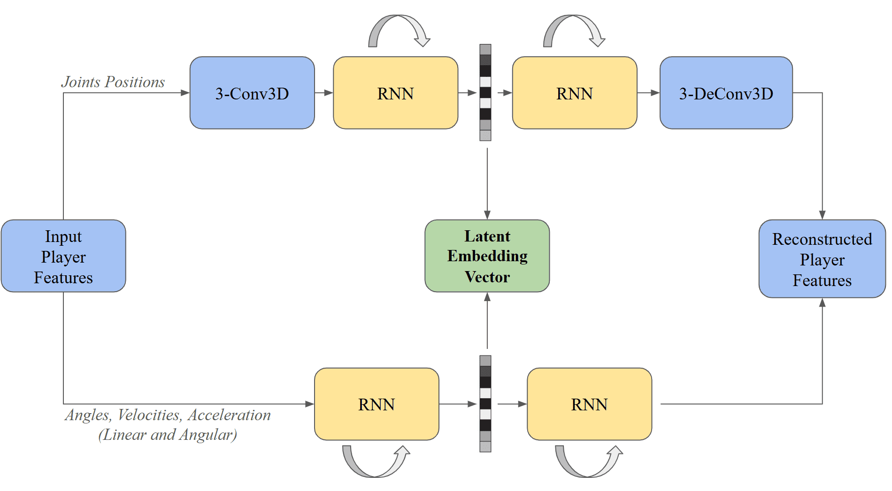
</p>

The encoder has two branches — one for raw 3D joint positions (Conv3D → RNN), one for the derived kinematics (angles, velocities, accelerations, also RNN) — merged into a single latent vector, then decoded back to reconstruct the input (`AutoEncoder/dataloader_hybrid.py` + `AutoEncoder/models/hybrid_64.py`).

Several encoder variants live in [`AutoEncoder/models/`](AutoEncoder/models):

| Model | Idea |
|---|---|
| `hybrid_64.py` / `hybrid_64_FC.py` | Dual-branch RNN autoencoder (above), plain vs. fully-connected bottleneck |
| `Recurrent_GRU.py` | GRU-based recurrent autoencoder |
| `Regularized.py` | Adds a regularization penalty on the latent space |
| `Variational.py` | Variational autoencoder — latent space as a distribution, not a point |
| `Denoising.py` | Trained to reconstruct clean features from noise-corrupted input |

Training curves for every architecture are tracked in [`loss/`](loss) (total / positional / angle / velocity / acceleration loss, linear and log scale):

<p align="center">
  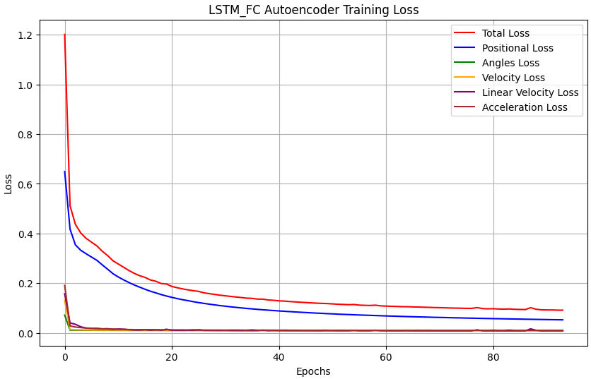
  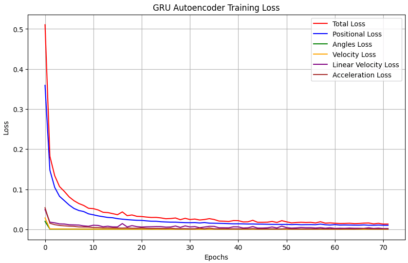
</p>

Once embeddings (or raw PCA components) are computed, `AutoEncoder/clustering.ipynb` explores the latent space with further PCA + KMeans clustering to see whether action types separate naturally.

---

## Ranking by similarity

Whichever representation is used, candidate actions are ranked against the reference (injury) embedding with four distance metrics computed in parallel — cosine, Euclidean, Mahalanobis, and Dynamic Time Warping (DTW compares the two sequences allowing them to stretch/shift in time, unlike a rigid frame-by-frame Euclidean match):

<p align="center">
  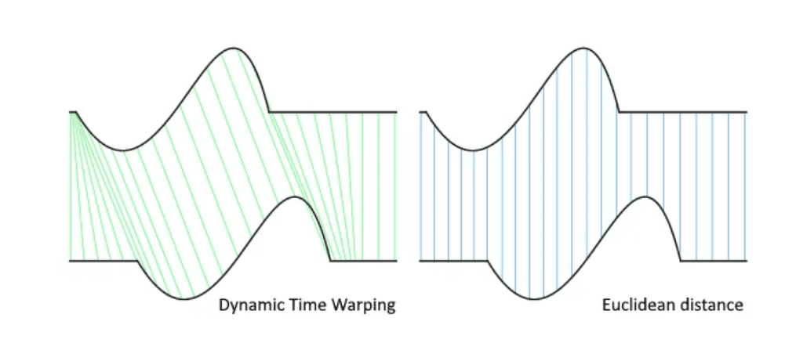
</p>

`hybrid.ipynb` builds one ranked DataFrame per metric (`df_cosine`, `df_euclidean`, `df_mahalanobis`, `df_dtw`) plus a combined score, then pulls the corresponding broadcast clip (`{match}/{action}.mp4`) for the top matches so results can be watched, not just scored.

---

## Case studies

Reference clips for three biomechanically distinct actions are tracked and embedded, then matched against the full-game database — visualized frame by frame in [`Frames_Visualization/`](Frames_Visualization):

<p align="center">
  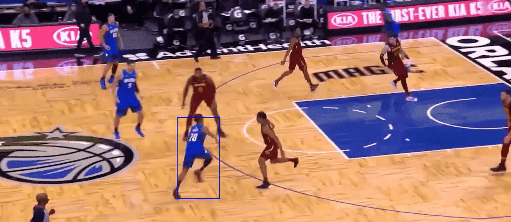
</p>

| Case | Reference action | Retrieved with |
|---|---|---|
| `fultz/` | Non-contact injury mechanics on a drive | naive PCA and a GRU embedding, side by side |
| `saric/` | Non-contact injury mechanics | LSTM embedding |
| `stepback/` | Hard stepback move | LSTM embedding |

Each folder contains the **original** reference frames next to the frames of the **retrieved** closest match(es), so the retrieval quality can be checked visually, action by action, not just by a distance number.

---

## Evaluation

Two complementary checks on retrieval quality:

- **Quantitative** (`AutoEncoder/Metrics/metrics_eval.py`, and the `spearmanr` / `ndcg_score` cells in `hybrid.ipynb`): rank correlation (Spearman) and ranking quality (NDCG) between metrics and against a reference ordering.
- **Qualitative, human-in-the-loop**: a forced-choice test where annotators pick the closest match among four candidates, plus a full ranking task, with inter-annotator agreement scored explicitly:

<p align="center">
  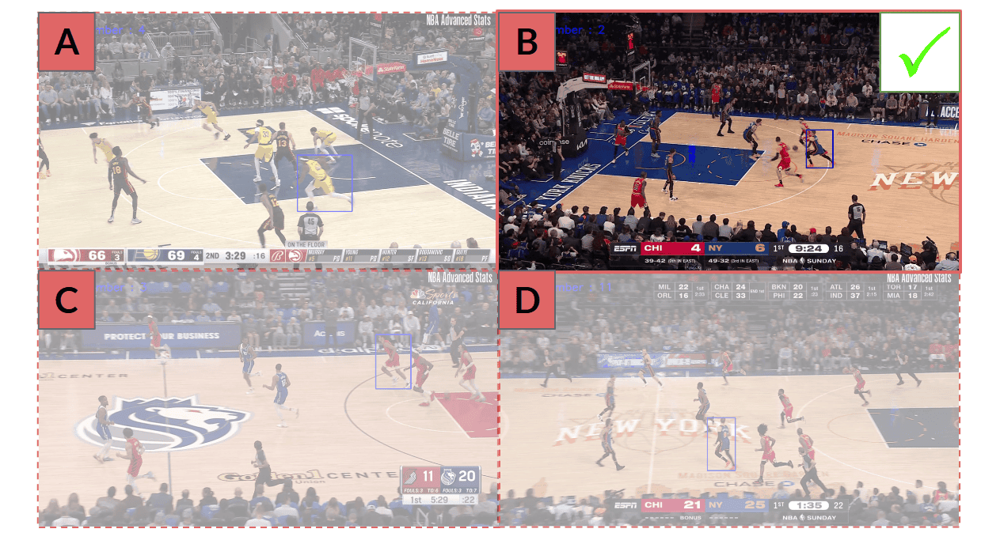
  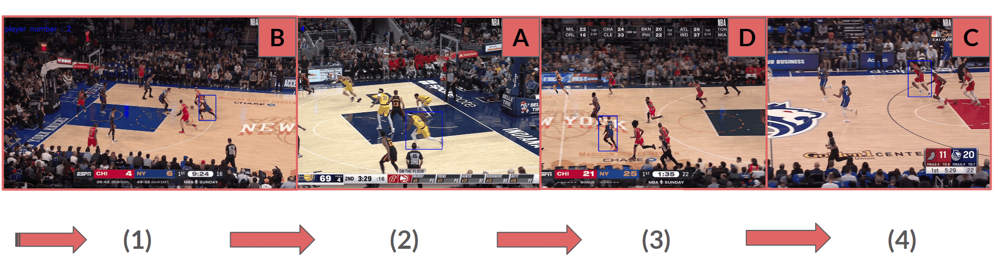
</p>

---

## Repository layout

```
NBA_Injury_action_retrieval/
├── hybrid.ipynb                 # End-to-end: features -> embeddings -> similarity -> ranked retrieval -> plots
├── AutoEncoder/
│   ├── dataloader_hybrid.py     # Windowing + feature extraction from players_data.json
│   ├── dataloader_flat.py       # Flat (non-hybrid) feature loader for the naive baseline
│   ├── models/                  # hybrid_64, hybrid_64_FC, Recurrent_GRU, Regularized, Variational, Denoising
│   ├── Metrics/                 # Quantitative retrieval evaluation
│   ├── clustering.ipynb         # Latent-space PCA + KMeans exploration
│   └── pretrained/              # Trained autoencoder checkpoints
├── Frames_Visualization/        # Reference vs. retrieved frames — fultz, saric, stepback
├── loss/                        # Training curves per architecture
├── methods/ · model_structure/  # Figures used throughout this README
└── Test_autoencoder.ipynb       # Standalone model sanity checks
```

---

## Part of a larger thesis pipeline

- [MixSortTracking_Dataset](../MixSortTracking_Dataset) — video → multi-player tracking
- [NBA-Players-Reconstruction](../NBA-Players-Reconstruction) — tracked player → Kalman-smoothed 3D pose
- **NBA_Injury_action_retrieval** (this repo) — pose sequences → motion embeddings → injury-risk retrieval
